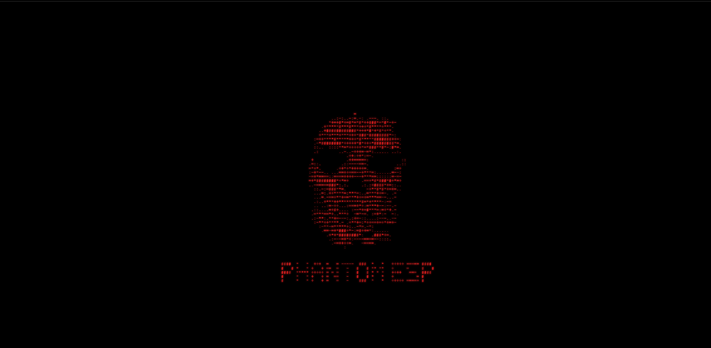
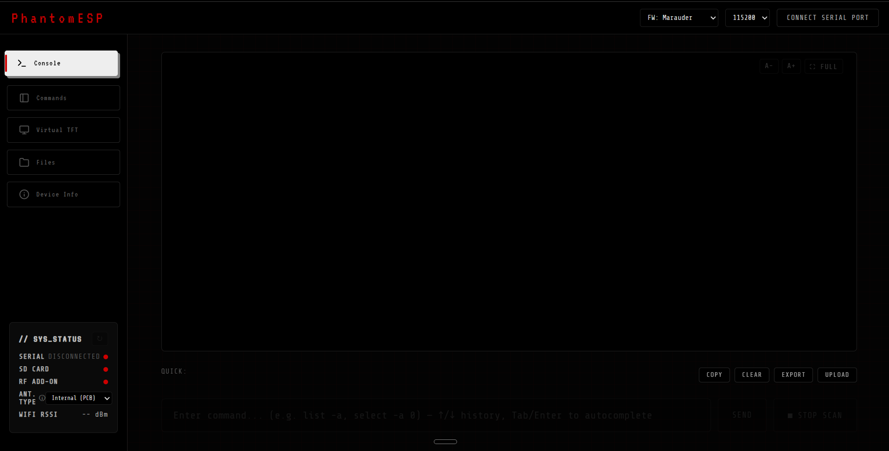

<div align="center">
  
  <h1>PhantomESP CyberSerial Dashboard</h1>
</div>

<div align="center">
  <p>A beautiful, modern, neo-brutalist web dashboard for controlling ESP32 firmware directly from your browser via the Web Serial API.</p>
</div>

---
## 📸 Screenshots

### Console View


### Command Center


---

## ⚡ Overview
This project provides a hardware-free, entirely web-based GUI for interacting with popular ESP32 security/hacker firmwares like **ESP32 Marauder**, **Ghost ESP**, and **Bruce**. It connects directly to your ESP32 via USB using the Web Serial API (supported by Chrome, Edge, and Opera). No local servers, Python scripts, or command lines required.

## ✨ Features
* **🔌 Direct Web Serial Connection**: Connect directly to your ESP32 from the browser at 115200 baud.
* **🎨 PhantomESP Theme**: A sleek, dark, hacker-inspired UI featuring neo-brutalist "Gumroad-style" hover animations.
* **🛠 Multi-Firmware Support**: Easily switch between **Marauder**, **Ghost ESP**, and **Bruce** modes to load dynamic Quick Command buttons.
* **📂 SD Card File Manager**: Stream files directly to your ESP32's SD Card from the web interface.
* **📡 Real-Time Hardware Status**: Automatically parses serial output to show real-time indicators for SD Card presence, Antenna hardware (CC1101/NRF24), and WiFi RSSI strength.
* **🕹️ Screen Mirror & D-Pad**: Built-in support for mirroring the ESP32 screen and sending WASD/D-Pad commands (for compatible firmware).

## ⚔️ Offensive & Defensive Capabilities

PhantomESP acts as a versatile command center for both Red Team (Offensive) and Blue Team (Defensive) operations when paired with compatible firmware like ESP32 Marauder.

### 🔴 Offensive (Red Team)
* **Deauthentication Attacks**: Disconnect clients from their access points (`attack -t deauth`).
* **Beacon Spam & Rickrolls**: Flood the airwaves with fake SSIDs or Rickroll nearby devices (`attack -t rickroll`).
* **Evil Portal**: Host captive portals to capture credentials (`evilportal`).
* **PMKID Sniffing**: Capture WPA2 PMKID handshakes for offline cracking (`sniffpmkid`).
* **Pwnagotchi / PineAP Detection**: Sniff and track Pwnagotchis or WiFi Pineapples in the vicinity.

### 🔵 Defensive (Blue Team)
* **Wardriving & GPS Tracking**: Map local access points to identify rogue APs, fully integrated with NMEA GPS receivers (`wardrive`).
* **Foxhunting**: Directional tracking to physically locate rogue transmitters (`foxhunt`).
* **Probe Monitoring**: Monitor client probe requests to detect active surveillance (`sniffprobe`).
* **MAC Tracking**: Keep a watchlist of known MAC addresses to detect intrusions (`mactrack`).

## 🚀 How to Use

1. Ensure you have a compatible browser (Google Chrome or Microsoft Edge).
2. Connect your ESP32 to your computer via a data USB cable.
3. Open `index.html` in your browser (you can double click the file, or host it via GitHub Pages).
4. Click **Connect Serial Port** and select the COM port corresponding to your ESP32.
5. Select your firmware type from the sidebar to load the appropriate quick commands.

## 🤖 Supported Firmwares

### [ESP32 Marauder](https://github.com/justcallmekoko/ESP32Marauder)
Fully supported. The dashboard automatically parses `sysinfo` to detect SD cards and attached hardware. Quick commands include scanning, sniffing, and attacks.

### Ghost ESP
Supported via the firmware selector. Dropdown dynamically loads Ghost ESP specific commands (e.g. `ap_scan`, `beacon_spam`).
Link: https://github.com/GhostESP-Revival/GhostESP

### Bruce
Supported via the firmware selector. Dropdown dynamically loads Bruce specific commands.
Link: https://github.com/BruceDevices/firmware

## ⚙️ Customization
To add your own custom quick commands, open `index.html` in a text editor and find the `firmwareCommands` object. Simply add your desired string to the array for your firmware, and it will automatically generate a button for it in the UI!

```javascript
const firmwareCommands = {
  marauder: ["help", "scanall", "stopscan", "list -a", "list -c", "sniffbeacon", "sniffprobe", "sniffpmkid"],
  ghostesp: ["help", "ap_scan", "sta_scan", "deauth", "beacon_spam", "stop"],
  bruce: ["help", "scan", "attack", "stop", "info", "settings"]
};
```

## 📜 License
This project is licensed under the MIT License - see the [LICENSE](LICENSE) file for details.
